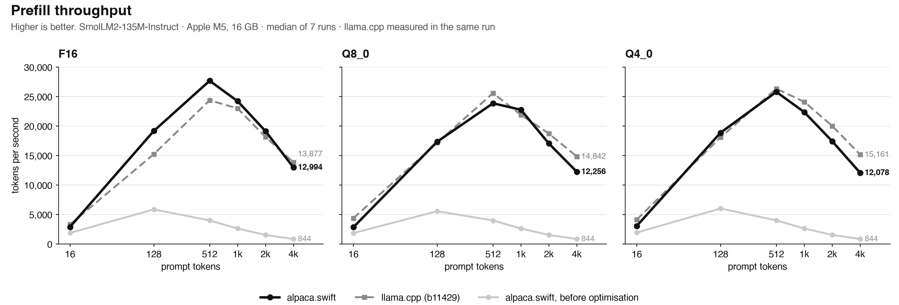
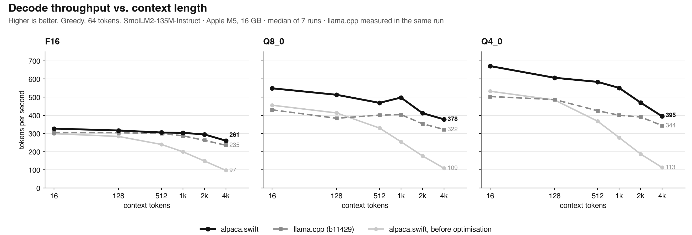
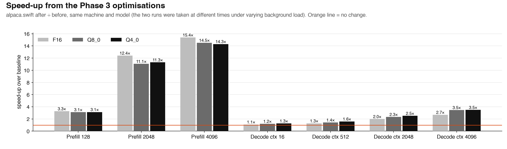

# alpaca.swift

**Native language model inference for Apple Silicon.**

A Swift-first inference runtime with custom Metal compute kernels, GGUF model loading and on-device autoregressive generation, built independently for macOS and iOS — no llama.cpp, MLX, Core ML, ONNX or Python at runtime.

*Author: Torin Etheridge · 2026-10-09 · MIT License*

> **Status — 0.1 (development).** One architecture family (Llama-style decoder, byte-level BPE) and three weight formats (F16, Q8_0, Q4_0) are implemented and validated against PyTorch. All measurements were taken on a single machine (Apple M5, 16 GB). **Nothing has been run on a physical iPhone or iPad yet**; the library and example app compile for the iOS Simulator only.

## Highlights

- **Independent implementation.** Tensor engine, CPU reference ops, GGUF parser, BPE tokenizer, Llama forward pass, sampler and all Metal kernels are written in this repository. Python/PyTorch is used only offline to generate reference fixtures.
- **Correctness first.** Every operation has a deterministic CPU reference and a test against independently generated vectors (numpy/PyTorch float64, the `gguf` package, Hugging Face `transformers`/`tokenizers`) with an explicit, justified tolerance. The CPU backend matches Hugging Face float32 to 5e-5 (F16) and 7e-5 (Q8_0) on logits; 191/191 tokenizer test strings produce identical token IDs; 72/72 greedy tokens match on every format.
- **Competitive performance, measured.** On the validation model, same machine and files, alpaca prefills 128 tokens at parity with llama.cpp (17.4k tok/s Q8_0) and decodes 1.02–1.38× faster at 16–4096 tokens of context (up to 1.4× on quantised files); it is still 7–20% slower at long-prompt prefill on quantised files. See [Docs/PERFORMANCE.md](Docs/PERFORMANCE.md) for the method, the bottleneck analysis and the optimisations that did *not* work.
- **Robust against hostile input.** The GGUF parser treats model files as untrusted: every length is bounded by the bytes actually present, all arithmetic is overflow-checked, and it survived 20,000 mutation-fuzzed files without a crash.
- **Idiomatic API.** `async` loading, `AsyncSequence` token streaming, cancellation, seeded sampling, per-generation isolated sessions, and a memory-budget check that refuses to load a model that will not fit.

## Contents

[Capabilities](#capabilities) · [Quick start](#quick-start) · [Results](#results) · [Numerical validation](#numerical-validation) · [Design](#design) · [Repository layout](#repository-layout) · [Reproducing the results](#reproducing-the-results) · [Limitations](#limitations) · [Roadmap](#roadmap) · [Citation](#citation) · [License](#license)

## Capabilities

| | |
|---|---|
| Architecture | Llama-style decoder: RMSNorm, RoPE (no scaling), grouped-query attention, SwiGLU, tied or untied output head |
| Weight formats (GGUF v2/v3) | F16, Q8_0, Q4_0 used in place from the memory-mapped file; Q4_1 tensors are expanded to F16 at load and reported |
| Metal backend | FlashAttention-style tiled prefill attention · split-K GQA decode attention · Metal 4 tensor-op GEMM (Apple10-family GPUs) with a float32 `simdgroup_matrix` fallback · fused single-token kernels · GPU-resident greedy decoding · f16 or f32 KV cache |
| CPU backend | Deterministic reference implementation (testing, debugging, machines without Metal) |
| Tokenizer | Byte-level BPE with the `gpt2` and `smollm` pre-tokenizers, UTF-8-safe streaming decode |
| Sampling | Greedy, temperature, top-k, top-p, seeded RNG, EOS and custom stop tokens |
| Platforms | macOS 14+, iOS 17+, Apple Silicon (arm64). Swift 6 language mode; developed with Swift 6.4 / Xcode 27 |

## Quick start

```swift
// Package.swift
.package(url: "https://github.com/torinriley/Alpaca.git", branch: "main")
// target dependency
.product(name: "Alpaca", package: "Alpaca")
```

```swift
import Alpaca

let model = try await LanguageModel.load(from: modelURL)           // GGUF, memory-mapped

let stream = model.generate(
    prompt: "<|im_start|>user\nExplain how transformers work.<|im_end|>\n<|im_start|>assistant\n",
    configuration: .init(maxTokens: 256, temperature: 0.7, seed: 42)
)
for try await token in stream { print(token.text, terminator: "") }

let s = stream.summary   // prompt/generated tokens, prefill & decode tok/s, time to first token, finish reason
```

Cancel with `stream.cancel()` or by cancelling the consuming `Task`. Each `generate` call owns its KV cache, so concurrent generations on one model never share mutable state. Prompts are raw text; apply your model's chat template yourself. Call `model.trimMemory()` on memory warnings and `model.cancelAllGenerations()` when the app leaves the foreground.

Command line:

```sh
Scripts/fetch_models.sh                      # SmolLM2-135M-Instruct (Apache-2.0) into ./Models
swift build -c release
.build/release/alpaca generate Models/gguf/SmolLM2-135M-Instruct-Q8_0.gguf --chat --prompt "Name three colors." --stats
.build/release/alpaca bench    Models/gguf/SmolLM2-135M-Instruct-Q8_0.gguf --backend metal --json out.json
.build/release/alpaca profile  Models/gguf/SmolLM2-135M-Instruct-Q8_0.gguf --tokens 2048 --context 2200
```

A SwiftUI reference app (model picker, streaming, cancellation, throughput and memory diagnostics) is in [`Examples/iOS/AlpacaDemo`](Examples/iOS/AlpacaDemo).

## Results

Apple M5 (10-core GPU), 16 GB, macOS 27.0, Swift 6.4. SmolLM2-135M-Instruct (30 layers, GQA 9/3, head dim 64). Median of 7 runs, 64 decoded tokens, greedy; llama.cpp build 11429 on the same GGUF files in the same run. The machine carried background load during measurement, so compare *within a graph* rather than across runs; the method, the full numeric grid and the caveats are in [Docs/PERFORMANCE.md](Docs/PERFORMANCE.md), the raw data in [`Benchmarks/`](Benchmarks).







| Q8_0 | before optimisation | **alpaca.swift** | llama.cpp | alpaca / llama.cpp |
|---|---|---|---|---|
| Prefill, 128 tokens (tok/s) | 5,563 | **17,351** | 17,163 | 1.01× |
| Prefill, 2048 tokens | 1,541 | **17,041** | 18,729 | 0.91× |
| Prefill, 4096 tokens | 844 | **12,256** | 14,842 | 0.83× |
| Decode, context 16 | 456 | **549** | 430 | 1.28× |
| Decode, context 2048 | 177 | **412** | 354 | 1.16× |

Q4_0 decode at context 16: **671** tok/s (llama.cpp 503). F16: **327** (305). Peak physical memory over the whole benchmark grid: 172–192 MiB at a 4400-token context. This is a 135M-parameter model on one device; the results do not extrapolate to larger models or other hardware.

## Numerical validation

Reference stack: numpy/PyTorch float64 for primitives, `gguf` for quantisation, Hugging Face `LlamaForCausalLM` (float64 on random models, float32 on the real model loaded *from the same GGUF weights* so that quantisation error is excluded), Hugging Face `tokenizers` for token IDs.

| level | what | result |
|---|---|---|
| 1 | primitives (add, mul, SiLU, matmul, RMSNorm, softmax, RoPE ×2 conventions, attention, Q8_0/Q4_0) | ≤ 2.5e-6 against float64; dequantisation bit-exact; quantiser byte-identical to `gguf` |
| 2–4 | tiny Llama (GQA/MHA, tied/untied, HF and GGUF RoPE layouts), incremental vs uncached decoding | ≤ 1.3e-6 against float64 PyTorch; cached == uncached exactly |
| 5 | SmolLM2-135M, CPU backend, last-token logits | 5e-5 (F16), 7e-5 (Q8_0), 1.6e-3 (Q4_0: three Q4_1 tensors rounded to F16) |
| 5 | same, default Metal configuration | within 1.5e-3 of the logit peak; 72/72 greedy tokens identical |
| 5 | Metal with `prefillPrecision: .exact` and f32 KV vs CPU | 2.7e-5 |

The default Metal configuration trades a small, bounded amount of precision for speed (half-precision prefill GEMM operands, f16 KV cache, half Q/P in tiled attention). Each reduced-precision component is isolated by its own test with an analytically derived bound, e.g. the fast GEMM must satisfy |error| ≤ 2⁻¹⁰ Σ|xₖwₖ| element-wise (observed worst case: 31% of the bound). Details, tolerances and the rationale for each: [Docs/NUMERICAL_VALIDATION.md](Docs/NUMERICAL_VALIDATION.md).

## Design

```
Alpaca            public API: LanguageModel · GenerationStream · errors             ─┐
AlpacaMetal       Metal context, kernels (.metal), GPU Llama model and sessions      │ depends on
AlpacaModels      GGUF parser, Llama weight mapping, tokenizer construction          │ ↓
AlpacaTokenizers  byte-level BPE                                                     │
AlpacaCore        tensors, CPU reference ops, KV cache, CPU Llama, sampler, memory  ─┘
AlpacaCLI         `alpaca` executable: info · generate · bench · profile
```

Weights are never copied: the GGUF file is memory-mapped and the whole mapping is wrapped as one no-copy `MTLBuffer` (unified memory), so resident weight memory is about the file size. A decode step is six fused dispatches per layer; greedy decoding runs entirely on the GPU with several command buffers in flight. Prefill uses 512-token chunks, a tiled flash-style attention kernel and tensor-op GEMMs with a one-matrix-at-a-time dequantisation scratch. Full description: [Docs/ARCHITECTURE.md](Docs/ARCHITECTURE.md).

## Repository layout

```
Sources/          AlpacaCore · AlpacaMetal (+ Kernels/*.metal) · AlpacaModels · AlpacaTokenizers · Alpaca · AlpacaCLI
Tests/            unit, kernel, parser/fuzz, tokenizer and real-model integration tests (+ generated fixtures)
Scripts/          fixture generators (Python, offline), model download, benchmark harness, llama.cpp comparison
Benchmarks/       raw JSON results for every number quoted in the docs
Docs/             ARCHITECTURE · NUMERICAL_VALIDATION · PERFORMANCE · MODEL_SUPPORT · DEVELOPMENT
Examples/iOS/     SwiftUI reference app
```

## Reproducing the results

```sh
Scripts/fetch_models.sh --with-reference     # ~800 MB: GGUF files + Hugging Face reference checkpoint
Scripts/test_all.sh                          # debug suite, then release suite incl. real-model validation
Scripts/compare_llamacpp.sh Benchmarks/results/mine   # needs llama-bench (e.g. brew install llama.cpp)
```
Regenerating the reference fixtures (PyTorch, `gguf`, `tokenizers`) is described in [Docs/DEVELOPMENT.md](Docs/DEVELOPMENT.md). Tests that need model files skip with a message when they are absent; real-model tests need an optimised build (`swift test -c release -Xswiftc -enable-testing`).

## Limitations

- Llama-family decoders only: no RoPE scaling (Llama 3.1+), sliding-window attention, MoE, biases or partial rotary.
- Tokenizer: byte-level BPE (`gpt2`, `smollm` pre-tokenizers). SentencePiece/Unigram models and the Llama-3 pre-tokenizer are rejected with an error.
- Quantisation: F16, Q8_0, Q4_0 (Q4_1 via load-time expansion). K-quants, Q5_x and BF16 are rejected. Activations are not quantised (unlike llama.cpp), so outputs are not bit-comparable with it.
- One sequence per generation; no continuous batching, paged attention or speculative decoding.
- Prefill is 7–20% slower than llama.cpp at 512–4096 tokens on quantised files and 12–35% slower at ≤ 24 tokens. The GPU-resident decode loop applies to greedy decoding only; stochastic sampling pays a CPU round trip per token (~15–20% slower).
- The fast prefill GEMM requires an Apple10-family GPU (M5/A19) and macOS/iOS 26; elsewhere the exact float32 path runs at roughly half the throughput (measured on M5 only).
- RoPE angles are float32 on the GPU (error ≈ 1e-7 × position radians). Models whose weights exceed `maxBufferLength` are loaded by copying.
- Not measured: iPhone/iPad execution, energy and sustained-load thermal behaviour, models other than SmolLM2-135M.

## Roadmap

Precision work driven by an ablation of every reduced-precision site with a perplexity/KL budget (mixed per-operation precision policy, split-Q attention scores); a short-prompt small-batch kernel; GPU-side stochastic sampling; Llama-3 tokenizer and RoPE scaling; larger-model and on-device validation. The reasoning behind each is in [Docs/PERFORMANCE.md](Docs/PERFORMANCE.md#remaining-bottlenecks-and-recommended-next-work).

## Citation

```bibtex
@software{etheridge2026alpaca,
  author = {Etheridge, Torin},
  title  = {alpaca.swift: Native language model inference for Apple Silicon},
  year   = {2026},
  url    = {https://github.com/torinriley/Alpaca}
}
```
See also [`CITATION.cff`](CITATION.cff).

## License

MIT © 2026 Torin Etheridge — see [LICENSE](LICENSE). The validation model is SmolLM2-135M-Instruct (Apache-2.0, HuggingFaceTB); GGUF conversions by bartowski. llama.cpp is used only as an external benchmark baseline and is not a dependency.
